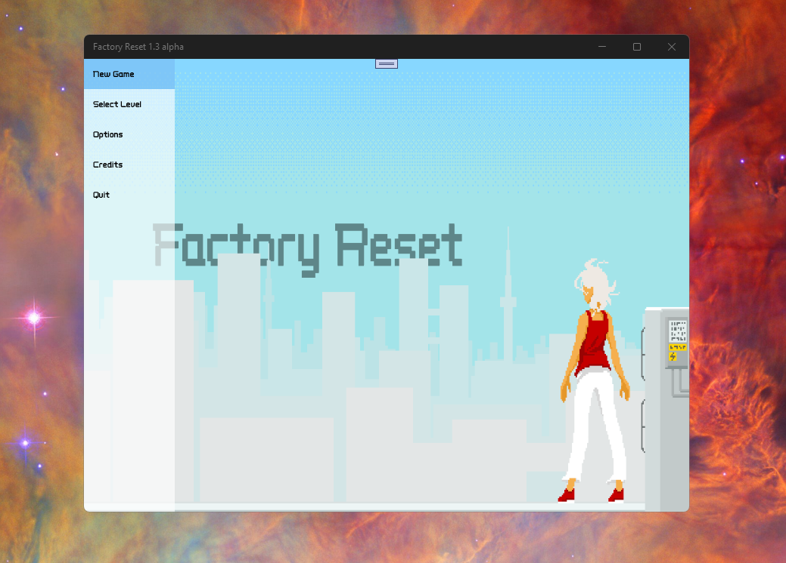
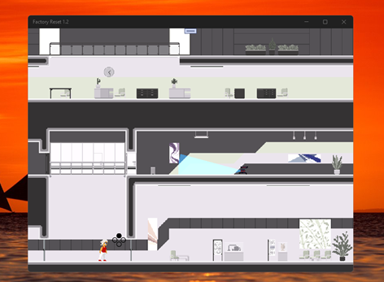
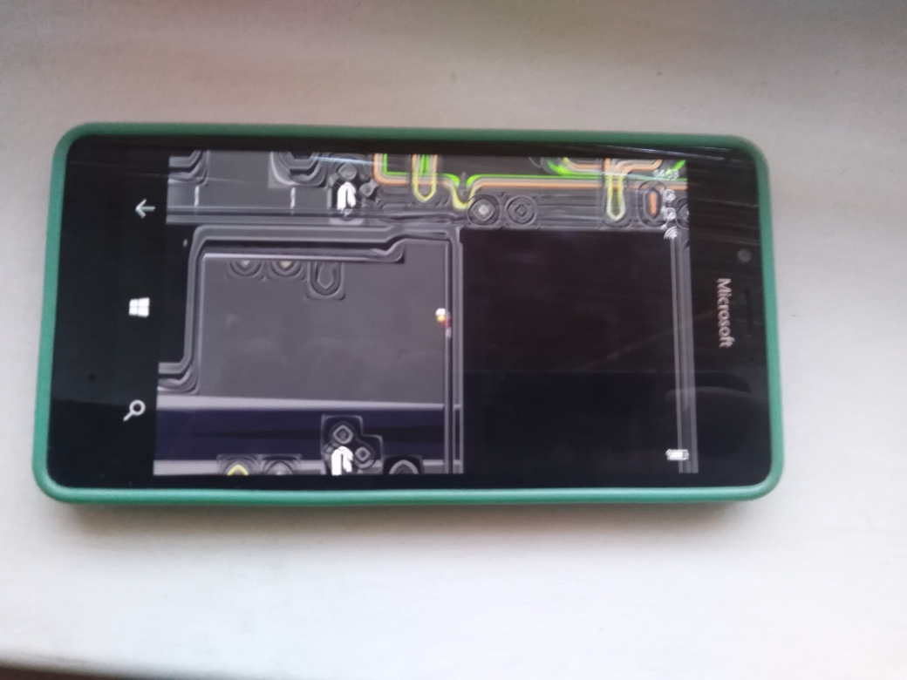

# FactoryReset v1.3.0 - dev branch

## About
This is new version of my "W10M replica" (uwp) of open-sourced FactoryReset game. The project based on monogame framework.  

## Game scenario
The main goal is reset some "futuristic" factory. I try to block unhappy game end (enemies don't want to open last door, I hope...))))) 

## Screenshots

## What's new?
- Futuristic (but semi-operational!) "2099 year" atmosphere (animated walls, trancparancy and 2.5-effects)
- New, experimental music theme
- New level "Cityscape" :)
- Potencial compatibility with poor Lumia smartphones (i.e., L640) 

## Tech. details
- UWP + 10240 Windows SDK & Monogame 3.8 support added 
- I switched from Hi-Def profile to Reach profile (at now, testure/shader xnb files are reach-compatible!)  
- TouchPanel control realized so-so 
- Damaged tile.fx shader suddenly generated "2099 year" atmosphere (I specially leave this fun bug!)
- Low-power mobile devices not supported (some hardware problems!), only *Lumia 950/XL* accepted!
- Half-Godmode enabled (enemy attacks *ignored*, but you may *loose life* after some bad move)))

## A few words about Idea & Design 
A 2D stealth action platformer with hand-crafted pixel-art animation. 
Made for the 2019 Games Programming Laboratory at ETH. A original game trailer can be seen on [YouTube](https://www.youtube.com/watch?v=L0zmt9HId54).

## Controlling via TouchPanel
- Swipe left/right/up/down: move left/right/up/down
- Tap (screen): jump (or skip long mom-dauther dialogs)))
- Double swipe down: hide
- Double swipe left: back 
- Double swipe right: open the door
- Double swipe up: call mom 
- Three-finger multi-touch: pause / menu

## TODO
- Test this build on my real Lumias 640 (W10M 15063) & 640 (W10M 10240/Astoria)
- Add src content (all png, sounds, etc.) 
- Fix tile.fx shader!
- Add custom levers load&run function 

## References
- https://shinmera.itch.io/factory-reset Original Factory Reset game (uwp for x64 Windows PC x64)
- https://shinmera.itch.io Shinmera, original Factory Reset c# developer / creator
- https://soundcloud.com/lukas-schoenwiese/ Music fragments: lukas-schoenwies (Factory & Toxic Factory)

## ..
AS IS. No support. RnD only / DIY.

## .
[m][e] November, 10 2025

