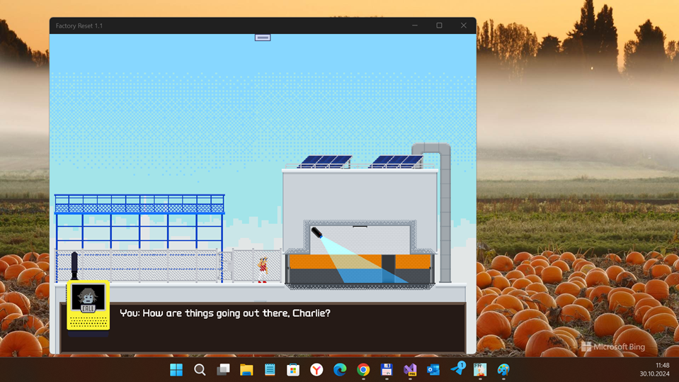

# FactoryReset v1.0.0

## About
My "W10M replica" (uwp) of open-sourced FactoryReset game project based on monogame framework.

## Screenshot(s)

## Status
- Original game micro-research ended
- Init State (Game consistance not tested at all)
- UWP + 10240 Windows SDK & Monogame 3.8 support added 
- TouchPanel control realized so-so :)
- Low-power mobile devices not supported (some hardware problems!), only *Lumia 950/XL* accepted!
- Half-Godmode enabled (enemy attacks *ignored*, but you may *loose life* after some bad move)))

## Game scenario
The main goal is reset some Sweddish factory :)

## Design / Tech. details
A 2D stealth action platformer with hand-crafted pixel-art animation. 
Made for the 2019 Games Programming Laboratory at ETH. A original game trailer can be seen on [YouTube](https://www.youtube.com/watch?v=L0zmt9HId54).

## Controlling via TouchPanel
- Swipe left/right/up/down: move left/right/up/down
- Tap (screen): jump (or skip long mom-dauther dialogs)))
- Double swipe down: hide
- Double swipe left: back (?)
- Double swipe right: open the door
- Double swipe up: call mom ;)
- Three-finger multi-touch: pause / menu

## References
- https://shinmera.itch.io/factory-reset Original Factory Reset game (uwp for x64 Windows PC x64)
- https://shinmera.itch.io Shinmera, original Factory Reset c# developer / creator

## TODO
- Try to use *Reach* profile (instead of HiDef), do more "MonoGame internals" research 
- Fix shaders (delete them at all, for low-powered devices)
- Add custom levers load&run function :)

## ..
AS IS. No support. RnD only / DIY

## .
[m][e] October, 29 2024

