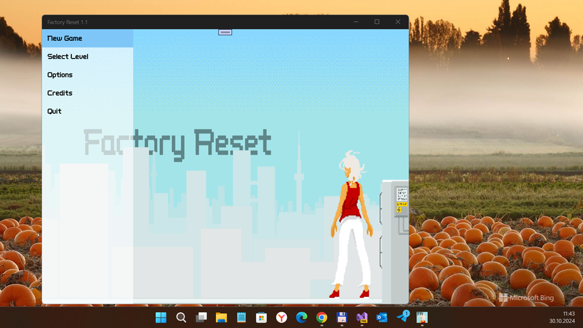
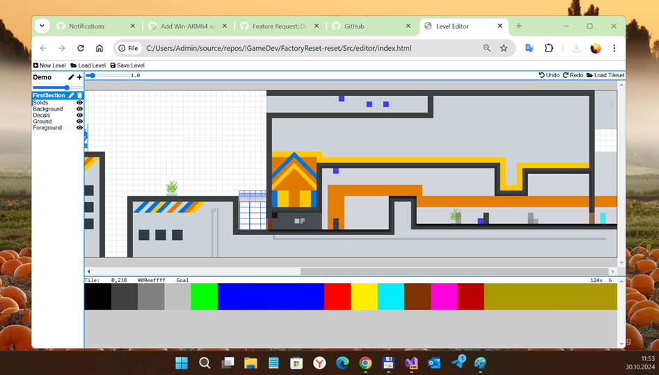

# FactoryReset 1.1 - reset branch

## About
My "W10M replica" (uwp) of open-sourced FactoryReset game project based on monogame framework.

## Screenshots

## Progress / Status
- I researched that Asperate-like leveleditor used.
- Aslo, customized level editor used (see Src/editor folder, use index.html and Google Chrome browser for level editing), and "Level complete" bug fixed for Demo level.
- Added realtime "game content building" (monogame rendrering tasks) from .png to xnb, etc. :)

## Game scenario
The year is 2099 and technology has taken over every aspect of our lives. Corporations have made everything as convenient and comfortable as can be. But at what cost? Is it really worth losing our independence to machines? What if an unforeseen catastrophe suddenly breaks out?

In Factory Reset you play the mother of three kids, caught up in an city-wide riot. A big drought has wiped out most of the food supplies and people have finally gone to the streets to protest against their corporate overlords. Jump across and through buildings and evade the detection of the drones! Find out what secrets the corporations have hidden from you for so long.

## Design / Tech. details
- A 2D stealth action platformer with hand-crafted pixel-art animation. Made for the 2019 Games Programming Laboratory at ETH. 
- A original game trailer can be seen on [YouTube](https://www.youtube.com/watch?v=L0zmt9HId54).

## References
- https://shinmera.itch.io/factory-reset Original Factory Reset game (uwp for x64 Windows PC x64)
- https://shinmera.itch.io Shinmera, original Factory Reset c# developer / creator

## ..
AS IS. No support. RnD only / DIY

## .
[m][e] October, 30 2024

